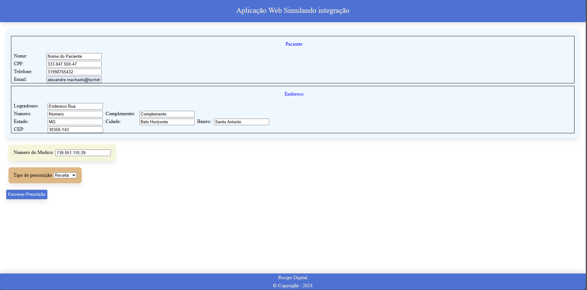

# Recipe.Integrations

Repositório com exemplos e documentação da integração com a Recipe Digital.

## Conteúdo

<details>
  <summary>Tabela de conteúdo</summary>
  <ol>
    <li>
      <a href="#integração">Integração</a>
      <ul>
        <li><a href="#requisitar-apikey">Requisitar ApiKey</a></li>
        <li><a href="#integração-com-o-script">Integração com o script</a></li>
        <li><a href="#interagir-com-o-script">Interagir com o script</a>
          <ul>
            <li><a href="#requestdto">RequestDTO</a></li>
          </ul>
        </li>
      </ul>
    </li>
    <li>
      <a href="#exemplos">Exemplos</a>
    </li>
    <li><a href="#utilização">Utilização</a>
      <ul>
        <li><a href="#cadastrando-profissionais-da-saúde">Cadastrando profissionais da saúde</a></li>
        <li><a href="#cadastro-do-paciente">Cadastro do Paciente</a></li>
        <li><a href="#nova-janela">Nova janela</a></li>
      </ul>
    </li>
    <li><a href="#contato">Contato</a></li>
  </ol>
</details>

## Integração


[Documentação da Api](url.com)

### Passos para uma integração bem-sucedida com a Recipe Digital

#### 1 - Requisitar ApiKey

Acesse o site [Recipe Digital](recipedigital.com.br) na aba "Fale conosco", ou entre em contato diretamente com o suporte usando o email contato@recipedigital.com.br.

#### 2 - Integração com o script

O script está disponível:
- Homologação
    - Pasta do repositório: assets/script
    - URL: [Integração de Homologação](https://int.recipedigital.com.br/scripts/recipe-integration-dev.min.js)
- Produção
    - Pasta do repositório: assets/script
    - URL: [url](urlScript)

#### 3 - Interagir com o script

```typescript
fazerRequisicao(requisicao: RequestDTO)
```
A requisição tem uma estrutura já pré-estabelecida. É necessário seguir alguns parâmetros.

#### RequestDTO

```Typescript
type RequestDTO = {
  ApiKey: string; //Obrigatório
  numeroDoMedico: string; //Obrigatório
  tipoPrescricao: number; //Obrigatório
  paciente?: Paciente; //Opcional
};
type Paciente = {
  nomeCompleto?: string; //Opcional
  documento: string; //Obrigatório
  telefone?: string; //Opcional
  email?: string; //Opcional
  endereco?: Endereco; //Opcional
};
type Endereco = {
  logradouro: string; //Obrigatório
  numeroEndereco: string; //Obrigatório
  complemento: string; //Obrigatório
  estado: string; //Obrigatório
  cidade: string; //Obrigatório
  bairro: string; //Obrigatório
  cep: string; //Obrigatório
};
```

É importante notar que o Paciente em si é opcional, mas caso seja enviado, é necessário ter pelo menos seu CPF. O mesmo princípio é o endereço do paciente, que não é obrigatório, mas caso seja enviado, é necessário que ele seja completo.

O `numeroDoMedico` pode ser qualquer número ÚNICO dentro da organização que ela utiliza para identificar o profissional (CPF, CRM, Matrícula, etc.).

## Exemplos



Utilizando a imagem acima como referência:

- O formulário em `aliceblue` é responsável pelas informações do Paciente.
- O formulário em `beige` é responsável pelo número de identificação do médico.
- O formulário em `burlywood` é responsável pelo tipo de prescrição.

Por favor, acesse as pastas `Exemplo_Vanilla` e `Exemplo_React` para ver exemplos práticos de integração.

## Utilização

### Nova janela

Ao fazer a requisição uma nova aba será aberta no navegador. Em algumas instancias o navegador poderá bloquear, indificando-a como pop-up. Caso necessário desbloquei o pop-up do dominio www.recipedigital.com.br

### Cadastrando Profissionais da Saúde

Ao realizar uma requisição para uma prescrição, o sistema automaticamente tentará detectar o profissional com seu número identificador. Caso não seja encontrado, o profissional será redirecionado automaticamente para uma tela de cadastro. Este cadastro é vinculado à organização, permitindo que o profissional tenha um perfil específico para cada organização, além do perfil pessoal.

### Cadastro do Paciente

As informações do paciente são opcionais, possibilitando o preenchimento dos dados na plataforma. Uma vez utilizadas, as informações são armazenadas na plataforma e associadas ao profissional, permitindo sua reutilização em prescrições futuras, mesmo que haja um intervalo entre elas. É importante observar que as informações enviadas por meio da integração têm prioridade sobre os dados armazenados na plataforma, sobrescrevendo-os quando fornecidos.

## Contato

- URL: [Recipe Digital](https://www.recipedigital.com.br)
- Email: contato@recipedigital.com.br
